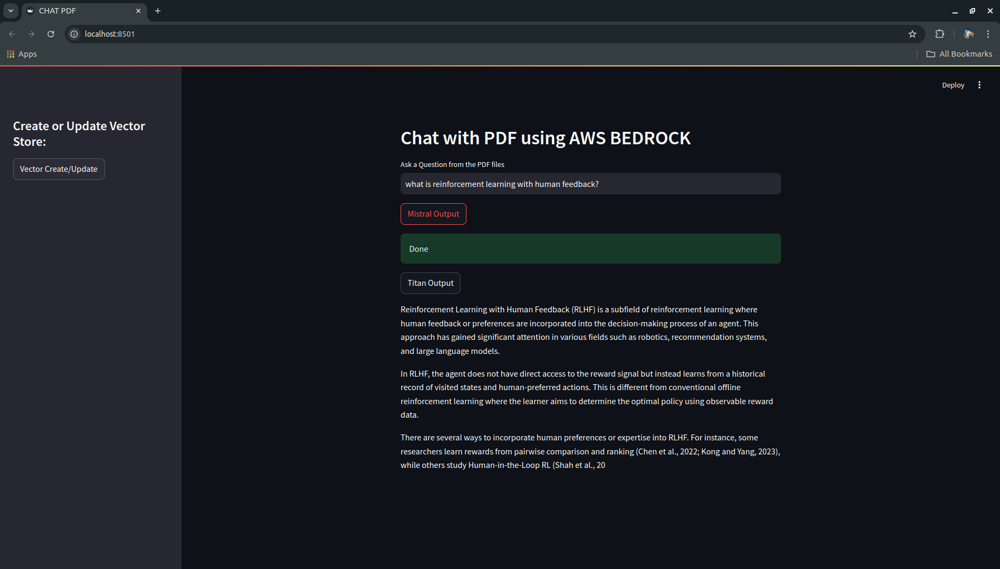
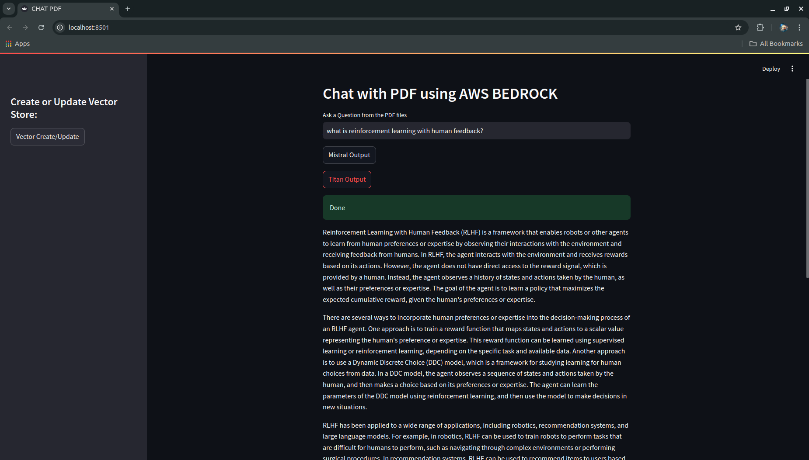

# My Python Project

**Description:**
Question and Answer application for documents with AWS Bedrock

**Getting Started:**
* **Prerequisites:** Python 3.x
* **Installation:** Clone the repository and run `pip install -r requirements.txt`.
* **Usage:** Run `streamlit run app.py`.

**ScreenShots:**

